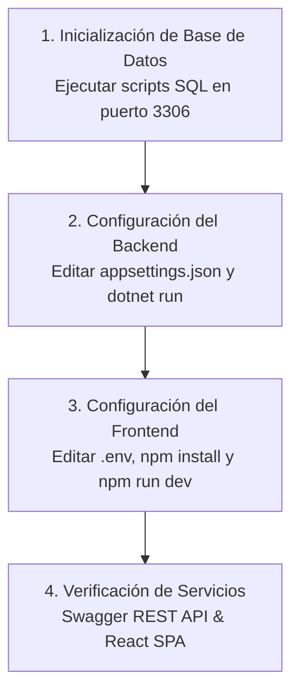

# Guía de Instalación y Configuración en Entorno Local

## 1. Requisitos Previos del Sistema

Para la instalación, ejecución y depuración de la plataforma DOSIER en un entorno de desarrollo local, se requieren los siguientes componentes de software:

| Componente | Versión Mínima Requerida | Propósito |
| :--- | :--- | :--- |
| **.NET SDK** | `8.0.x` | Compilación y ejecución de la solución backend (`backend/dosier.slnx`). |
| **Node.js** | `18.x` o superior | Entorno de ejecución para la SPA React (`dosier_web`). |
| **npm** | `9.x` o superior | Gestor de paquetes de dependencias del frontend. |
| **MariaDB / MySQL** | `10.5+` / `8.0+` | Motor de base de datos relacional (Puerto `3306`). |

---

## 2. Procedimiento de Instalación Paso a Paso



### Paso 1: Inicialización de la Base de Datos
1. Inicie el servidor MariaDB/MySQL en el puerto local `3306`.
2. Cree la base de datos vacía denominada `sigafi_es`.
3. Ejecute los scripts SQL ubicados en la carpeta `scripts/base_datos/`:
   * `Primera versión (formato proyecto de investigación) bien.sql`: Crea las tablas del esquema relacional.
   * `seed_profesores_carreras.sql`: Poblado inicial de catálogos de carreras y docentes SIGAFI.
   * `seed_real_data.sql`: Datos de prueba para desarrollo (plantillas documentales y catálogos PND/UNESCO).

### Paso 2: Configuración y Arranque del Backend (.NET 8.0)
1. Navegue al directorio del controlador API:
   ```bash
   cd backend/dosier_api
   ```
2. Verifique la cadena de conexión a la base de datos en `appsettings.Development.json`:
   ```json
   {
     "ConnectionStrings": {
       "DefaultConnection": "Server=localhost;Port=3306;Database=sigafi_es;Uid=root;Pwd=tu_contraseña;"
     },
     "Jwt": {
       "Secret": "CLAVE_SECRETA_DE_ALTA_ENTROPIA_PARA_DESARROLLO_32_BYTES",
       "Issuer": "dosier.traversari.edu.ec",
       "Audience": "dosier-clients"
     }
   }
   ```
3. Inicie el servidor web de desarrollo:
   ```bash
   dotnet run
   ```
4. Verifique la disponibilidad de la API accediendo a `https://localhost:7194/swagger` o `http://localhost:5000/swagger`.

### Paso 3: Configuración y Arranque del Frontend (React + Vite)
1. Navegue al directorio del proyecto web:
   ```bash
   cd dosier_web
   ```
2. Verifique el archivo de variables de entorno `.env`:
   ```env
   VITE_API_BASE_URL=http://localhost:5000/api
   VITE_WS_URL=ws://localhost:5000/collaborationHub
   ```
3. Instale las dependencias de Node.js:
   ```bash
   npm install
   ```
4. Inicie el servidor de desarrollo Vite:
   ```bash
   npm run dev
   ```
5. Acceda a la aplicación web a través de la URL dev (por defecto `http://localhost:5173`).
