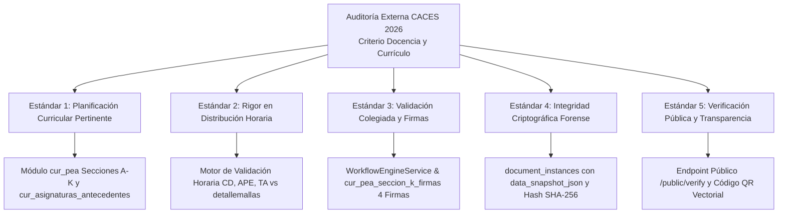

# Guía de Cumplimiento Curricular e Integridad Forense para Acreditación CACES 2026

## 1. Visión General del Proceso de Evaluación Externa

Esta guía técnica establece cómo los subsistemas, tablas y servicios de la plataforma DOSIER sustentan el cumplimiento de los estándares de calidad exigidos por el **Consejo de Aseguramiento de la Calidad de la Educación Superior (CACES)** para los procesos de acreditación y evaluación institucional de institutos superiores técnicos y tecnológicos del Ecuador.

La plataforma convierte la formulación curricular y la gestión de portafolios docentes en un repositorio de **evidencias digitales inmutables, trazables y auditables**.

---

## 2. Matriz de Correspondencia entre Estándares CACES y Subsistemas DOSIER

---

## 3. Detalle de Estándares de Evaluación y Evidencias Técnicas

### 3.1. Estándar 1: Coherencia Curricular y Planificación Microcurricular
* **Exigencia CACES:** Los institutos deben demostrar que cada asignatura cuenta con un Programa de Estudio de la Asignatura (PEA) actualizado, que articula los objetivos de aprendizaje con el perfil de egreso y las competencias del proyecto de carrera aprobado por el CES.
* **Respaldo Técnico en DOSIER:**
  * Tabla `cur_asignaturas_antecedentes`: Provee la fundamentación epistemológica institucional precargada para cada materia.
  * Tablas `cur_pea_seccion_c_objetivos`, `cur_pea_seccion_d_competencias` y `cur_pea_seccion_e_resultados`: Mapean taxativamente la tributación al perfil profesional.

### 3.2. Estándar 2: Cumplimiento Estricto de Carga Horaria (CES RRA)
* **Exigencia CACES:** Comprobar que las horas asignadas a la docencia teórica, aprendizaje práctico-experimental (laboratorios/talleres) y trabajo autónomo correspondan de manera inviolable a la malla curricular y a los créditos reconocidos.
* **Respaldo Técnico en DOSIER:**
  * Al momento de formular el PEA, el sistema consulta `detallemallas` de SIGAFI y bloquea el avance del documento si la suma de unidades temáticas en `cur_pea_seccion_f_contenidos` difiere en un solo minuto de las horas normadas.

### 3.3. Estándar 3: Circuito de Revisión Colegiada y 4 Firmas Institucionales
* **Exigencia CACES:** Evidenciar que la planificación microcurricular fue sometida a revisión colegiada por las comisiones académicas y aprobada formalmente por las autoridades institucionales previo al inicio de las clases.
* **Respaldo Técnico en DOSIER:**
  * Circuito formal de 4 etapas implementado en `WorkflowEngineService`:
    1. **Elaboración:** Docente/s autor/es (`DOSIER_DOCENTE`).
    2. **Revisión de Carrera:** Coordinador de Carrera (`DOSIER_COORD_CARRERA`).
    3. **Verificación Académica:** Coordinador Académico (`DOSIER_COORD_ACAD`).
    4. **Aprobación Oficial:** Vicerrectorado (`DOSIER_VICERRECTOR`).
  * Cada etapa estampa un registro auditable en `cur_pea_seccion_k_firmas` y `document_signatures` con marcas de tiempo UTC y certificado criptográfico.

### 3.4. Estándar 4: Integridad Criptográfica Forense (*State Locking*)
* **Exigencia CACES:** Garantizar que los documentos curriculares entregados para auditoría no hayan sido modificados retroactivamente o adulterados con posterioridad a su aprobación.
* **Respaldo Técnico en DOSIER:**
  * **Bloqueo Inmutable (*State Locking*):** En el instante en que Vicerrectorado estampa la firma final, el estado pasa a `Aprobado` y la capa de servicios prohíbe cualquier mutación sobre las tablas de secciones.
  * **Snapshot JSON y Hash SHA-256:** El contenido exacto se congela en `document_instances.data_snapshot_json` y se calcula un hash criptográfico SHA-256 sobre la cadena serializada y sobre el binario del PDF generado mediante `iText 9`.

### 3.5. Estándar 5: Acceso y Verificación Pública para Evaluadores Externos
* **Exigencia CACES:** Facilitar a los pares evaluadores del CACES mecanismos ágiles para verificar la legitimidad de las evidencias presentadas en los portafolios docentes, tanto en formato digital como en impresiones físicas.
* **Respaldo Técnico en DOSIER:**
  * Cada ejemplar oficial emitido lleva embebido un **código QR vectorial** con un código de trazabilidad único.
  * Al escanear el código QR con cualquier lector estándar o dispositivo móvil, el evaluador es dirigido al portal público `/public/verify/{traceability_code}`.
  * El portal consulta directamente la base institucional y certifica ante el evaluador:
    * Nombre oficial de la asignatura y código de malla.
    * Período académico ordinario.
    * Nómina de docentes que elaboraron el documento y autoridades que lo aprobaron.
    * Coincidencia íntegra del hash SHA-256 del documento físico con el archivo institucional custodiado.

---

## 4. Procedimiento de Muestra y Auditoría In Situ

Durante las visitas de inspección técnica del CACES, el administrador de DOSIER o la Coordinación de Aseguramiento de la Calidad puede ejecutar las siguientes acciones:

1. **Exportación Masiva de Expedientes:** Generación de paquetes comprimidos con los PDFs firmados electrónicamente de todas las asignaturas vigentes en el período auditado.
2. **Reporte Forense de Auditoría:** Extracción de la bitácora `audit_logs` que demuestra las fechas y horas exactas en que cada docente elaboró y cada autoridad revisó el currículo, refutando cualquier sospecha de confección apresurada o extemporánea.
3. **Validación de Códigos QR:** Demostración en vivo ante el comité evaluador escaneando documentos impresos al azar para corroborar la respuesta inmediata del nodo de verificación pública.
