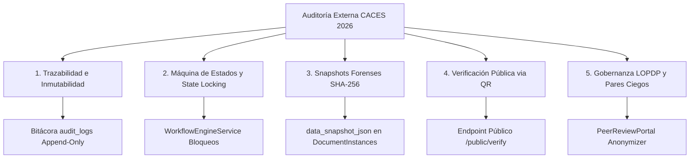

# Guía de Cumplimiento e Integridad Forense para Acreditación CACES 2026

## 1. Visión General del Marco Normativo

Esta guía especifica cómo los subsistemas de la plataforma DOSIER responden a los criterios de evaluación, transparencia, inmutabilidad y control de calidad institucional exigidos por el **Consejo de Aseguramiento de la Calidad de la Educación Superior (CACES)** para los procesos de acreditación 2026 de Institutos Superiores Tecnológicos.

---

## 2. Matriz de Cumplimiento Técnico y Evidencias Auditables

---

## 3. Desglose de Criterios de Evaluación CACES

### 3.1. Criterio 1: Trazabilidad Completa del Ciclo de Vida
* **Requerimiento CACES:** Demostrar el rastro inalterable de aprobación y revisión de cada proyecto de investigación.
* **Respuesta Técnica DOSIER:** La tabla `audit_logs` captura atómicamente la identidad del usuario, dirección IP, marca de tiempo UTC y las diferencias en JSON antes y después de cada cambio en la propuesta.

### 3.2. Criterio 2: Control de Transiciones y Congelamiento (*State Locking*)
* **Requerimiento CACES:** Garantizar que los proyectos aprobados no hayan sido modificados posteriormente por los docentes o administradores.
* **Respuesta Técnica DOSIER:** El `WorkflowEngineService` implementa bloqueos automáticos de edición al cambiar el proyecto a estado de evaluación o aprobación, rechazando cualquier intento de actualización HTTP sobre campos congelados.

### 3.3. Criterio 3: Resiliencia Forense mediante Snapshots SHA-256
* **Requerimiento CACES:** Garantizar que el contenido físico impreso coincida exactamente con la información aprobada en la fecha de emisión.
* **Respuesta Técnica DOSIER:** La tabla `document_instances` guarda el objeto `data_snapshot_json` congelado en el momento exacto de la emisión y calcula el hash de integridad **SHA-256** sobre el payload y el PDF renderizado por `iText 9`.

### 3.4. Criterio 4: Nodo de Verificación Pública de Autenticidad (QR)
* **Requerimiento CACES:** Permitir a los pares evaluadores del CACES validar la autenticidad de cualquier acta o resolución firmada sin requerir credenciales internas del sistema.
* **Respuesta Técnica DOSIER:** Cada PDF emitido lleva inyectado un código QR vectorial dinámico que redirige al endpoint público `/public/verify/{traceability_code}`, donde el servidor valida el hash SHA-256 y despliega los metadatos de aprobación en tiempo real.

### 3.5. Criterio 5: Imparcialidad y Gobernanza LOPDP
* **Requerimiento CACES:** Asegurar la objetividad en la evaluación de propuestas y el respeto a la protección de datos personales.
* **Respuesta Técnica DOSIER:** El `PeerReviewPortalService` ejecuta un filtro de anonimización completa (*Blind Mode*) removiendo nombres, correos e instituciones de los autores antes de entregar la propuesta a los pares evaluadores.
