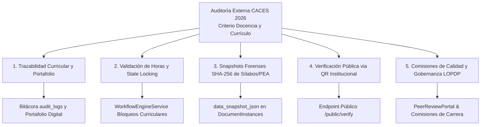

# Guía de Cumplimiento Curricular e Integridad Forense para Acreditación CACES 2026

## 1. Visión General del Marco Normativo

Esta guía especifica cómo los subsistemas de la plataforma DOSIER responden a los criterios de evaluación, transparencia, inmutabilidad curricular y control de calidad institucional exigidos por el **Consejo de Aseguramiento de la Calidad de la Educación Superior (CACES)** para los procesos de acreditación y aseguramiento de la calidad de la docencia en el **ISTPET**.

---

## 2. Matriz de Cumplimiento Curricular y Evidencias Auditables

---

## 3. Desglose de Criterios de Evaluación CACES

### 3.1. Criterio 1: Organización Curricular y Portafolio Docente
* **Requerimiento CACES:** Demostrar la existencia, vigencia y coherencia de los Programas de Estudio de la Asignatura (PEA), Sílabos de 19 semanas y Guías APE, así como el rastro inalterable de aprobación por las comisiones de carrera.
* **Respuesta Técnica DOSIER:** La tabla `audit_logs` y el módulo de portafolio capturan la identidad del docente autor, revisiones de la comisión, marcas de tiempo UTC y las diferencias en JSON de cada iteración de la planificación.

### 3.2. Criterio 2: Cumplimiento de Carga Horaria y Congelamiento (*State Locking*)
* **Requerimiento CACES:** Garantizar que los sílabos aprobados respeten la distribución exacta de horas de la malla (Docencia, APE, Trabajo Autónomo) y no sean alterados durante el período lectivo.
* **Respuesta Técnica DOSIER:** El motor de validación curricular verifica la suma de 19 semanas y el `WorkflowEngineService` activa el congelamiento de edición al pasar a estado `APROBADO` o `VIGENTE`, rechazando modificaciones extemporáneas.

### 3.3. Criterio 3: Resiliencia Forense mediante Snapshots SHA-256
* **Requerimiento CACES:** Garantizar que el documento impreso o presentado en auditorías coincida exactamente con la planificación académica aprobada al inicio del ciclo.
* **Respuesta Técnica DOSIER:** La tabla `document_instances` almacena el `data_snapshot_json` congelado al momento de la firma y calcula el hash criptográfico **SHA-256** sobre el payload y el PDF oficial generado por el motor `iText 9`.

### 3.4. Criterio 4: Nodo de Verificación Pública de Autenticidad (QR)
* **Requerimiento CACES:** Permitir a los pares evaluadores del CACES validar la autenticidad e integridad de cualquier sílabo, PEA o portafolio docente escaneando su código de seguridad sin requerir credenciales internas.
* **Respuesta Técnica DOSIER:** Cada PDF oficial emitido lleva inyectado un código QR vectorial que redirige al endpoint público `/public/verify/{traceability_code}`, donde el servidor valida el hash SHA-256 y despliega los metadatos de aprobación en tiempo real.

### 3.5. Criterio 5: Validación Colegiada y Protección de Datos LOPDP
* **Requerimiento CACES:** Asegurar la rigurosidad pedagógica mediante revisión por pares/comisiones y el respeto a la protección de datos personales de la comunidad académica.
* **Respuesta Técnica DOSIER:** El subsistema `PeerReviewPortalService` y `LopdpService` permiten dictámenes curriculares basados en rúbricas objetivas, gestionando consentimientos informados y trazabilidad inmutable.
