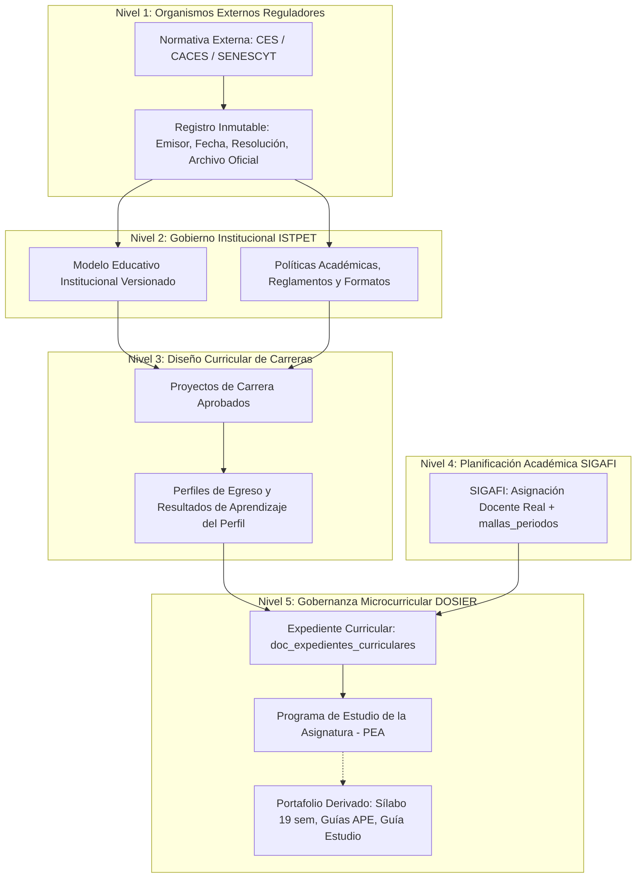
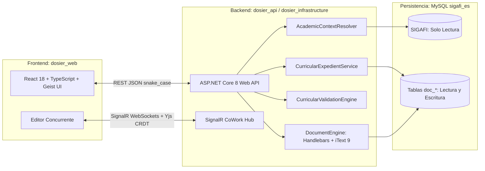
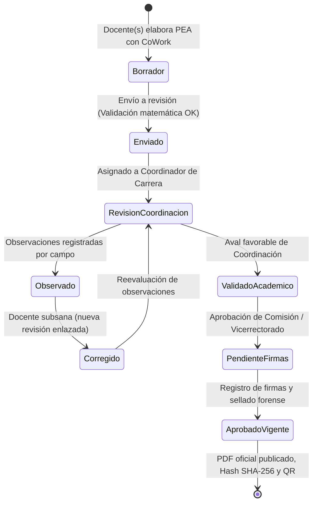

# CODEX: Plataforma DOSIER — Gobernanza Curricular y Gestión Documental Académica
## Diagnóstico Institucional, Arquitectura de Integración y Plan Maestro

> **Institución:** Instituto Superior Tecnológico Mayor Pedro Traversari (ISTPET) — Quito, Ecuador  
> **Tema de Tesis:** Sistema web de gestión curricular para el Programa de Estudio de la Asignatura del Instituto Superior Tecnológico Mayor Pedro Traversari  
> **Sistema:** Plataforma Clean Architecture DOSIER  
> **Base de Datos Institucional:** MySQL `sigafi_es` (Modo Solo Lectura)  
> **Área:** Dirección Académica, Coordinaciones de Carrera y Aseguramiento de la Calidad (CACES)  
> **Tipo de Documento:** Especificación técnica integral y delimitación definitiva de tesis  

---

## 1. Diagnóstico Técnico de la Base de Datos Institucional (`sigafi_es`)

La base de datos institucional `sigafi_es` contiene más de 200 tablas que administran la operación académica, financiera y administrativa del ISTPET. El análisis en modo de solo lectura arrojó los siguientes hallazgos, capacidades y restricciones para la integración con DOSIER:

### 1.1. Delimitación y Frontera Fundamental
> **SIGAFI administra la oferta académica operativa real:** carreras, períodos, mallas aplicadas por cohorte y nivel, asignaciones docentes, modalidades, jornadas y calendario.  
> **DOSIER consume esos datos en modo de solo lectura (`AsNoTracking()`) y gestiona exclusivamente el ciclo institucional de gobernanza curricular y producción documental.**  
> **Queda estrictamente prohibido replicar la administración académica dentro de DOSIER o alterar la base de datos de SIGAFI.**

---

### 1.2. Inventario y Evaluación de Tablas de SIGAFI

#### A. Núcleo Curricular
* **Tablas analizadas:** `carreras`, `mallas`, `detallemallas`, `asignaturas`, `cursos`, `tipos_asignatura`, `prerequisitos`.
* **Hallazgo en `detallemallas`:**
  * Contiene **1.086 registros curriculares** no anulados.
  * El 100% cuenta con horas totales oficiales.
  * El 100% cuenta con horas docentes oficiales.
  * El 100% cuenta con créditos académicos.
  * Solo 1 registro carece de horas práctico-experimentales (APE).
  * Las horas de trabajo autónomo pueden derivarse matemáticamente:  
    $$\text{Horas Autónomas} = \text{Horas Totales} - (\text{Horas Docencia} + \text{Horas APE})$$
  * Esta información es consumida por el backend en `AsignaturasDocenteService.cs`.

#### B. Planificación Académica
* **Tablas analizadas:** `periodos`, `asignaciones_profesores`, `profesores_carreras_periodos`, `modalidades`, `parciales`, `parciales_modalidades_fechas`, `horario_detalle`, `fechas_horarios`, `horas_clases`.
* **Hallazgo en `asignaciones_profesores`:**
  * Supera los **23.000 registros históricos** con relaciones íntegras: asignatura, período, nivel y modalidad.
  * Permite conocer de forma unívoca quién debe elaborar cada documento, para qué asignatura, carrera, modalidad, paralelo y período. Origen mandatorio de todo expediente curricular.

#### C. Identidad Institucional y Autoridades
* **Tablas analizadas:** `usuarios`, `profesores`, `contratos`, `cargo_instituto`, tablas `rbac_*`.
* **Hallazgo en `cargo_instituto` y `contratos`:**
  * Incluye cargos como rector, vicerrector, profesor, docente, gestor educativo y directores.
  * La relación vincula al personal con su designación legal vigente, utilizada por `SignatureProfileSubservice.cs` para obtener automáticamente el pie de firma.
  * *Limitación detectada:* Permite conocer el cargo de una persona al firmar, pero no basta para resolver dinámicamente aprobadores curriculares por carrera o período. Esa asignación debe gestionarse en DOSIER.

---

### 1.3. Tablas de SIGAFI No Aprovechadas Previamente y su Incorporación

1. **`mallas_periodos` (Piedra angular de resolución curricular):**
   * Relaciona formalmente:
     $$\text{Período} + \text{Nivel} \longrightarrow \text{Malla Aplicable}$$
   * Permite resolver qué malla corresponde a cada cohorte durante períodos de transición curricular.  
     *Ejemplo real comprobado:* En períodos anteriores, la carrera de Desarrollo de Software tuvo niveles avanzados cursando la malla 2020 y niveles iniciales cursando la malla rediseñada 2023.
   * *Corrección introducida:* Se descarta el enfoque previo de buscar únicamente `mallas.activa = 1` (el cual rompía la reconstrucción histórica). La resolución oficial es:  
     $$\text{Período} + \text{Nivel} \longrightarrow \text{mallas\_periodos} \longrightarrow \text{Malla} \longrightarrow \text{detallemallas}$$
2. **`modalidades_carreras`:**
   * Especifica las modalidades formalmente autorizadas por carrera:
     * *Desarrollo de Software:* Presencial y En línea.
     * *Administración de Talento Humano:* Híbrida.
     * *Educación Básica:* Semipresencial.
     * *Mecánica Automotriz:* Presencial.
   * Valida que ningún documento curricular sea generado para combinaciones no autorizadas.
3. **`secciones`:**
   * Contiene las jornadas institucionales (Matutina, Vespertina, Nocturna, Fin de semana). Contextualiza la asignación docente sin alterar el contenido sustantivo del PEA.
4. **`semanas_horarios` y `fechas_semanas`:**
   * Define hasta 20 semanas e identifica semanas de evaluación parcial y final. En `ABR2026` cuenta con 139 registros. Sirve como base para la futura matriz semanal del Sílabo.
5. **Tablas descartadas o no aplicables:**
   * `agenda_academica`: Contiene únicamente registros obsoletos de 2017. Descartada.
   * `seddautoridadescarrerasperiodos`: Estructura adecuada para revisores por carrera, pero actualmente vacía en la base institucional.

---

### 1.4. Regla de Aislamiento Institucional: Separación de la Escuela de Conducción

La base de datos `sigafi_es` aloja conjuntamente la oferta del Instituto y la oferta de la Escuela de Conducción. Para blindar a DOSIER se aplican dos reglas mandatorias:

1. **Filtro estricto por carrera:**  
   Toda consulta curricular debe aplicar obligatoriamente:
   $$\text{carreras.esInstituto} = 1$$
2. **Exclusión de tablas ajenas:**  
   Quedan expresamente fuera del alcance de DOSIER las tablas propias de conducción: `cond_*`, `alumnos_acta_conduccion`, `calificaciones_conduccion`, `categorias_examenes_conduccion`, `asignacion_instructores_vehiculos`, `vehiculos`, `vehiculos_operacion`.
3. **Identificación institucional:**  
   La tabla `instituciones_instituto` contiene dos registros separados (el Instituto y la Escuela de Conducción). DOSIER filtra exclusivamente el registro correspondiente al ISTPET.

---

### 1.5. Problemas de Calidad de Datos Detectados en SIGAFI

1. **Inconsistencia de banderas de período activo:**  
   `OCT2025` conserva `periodoactivoinstituto = 1` a pesar de haber concluido, mientras que `ABR2026` figura como período de planificación sin la bandera activa. La resolución debe evaluar fechas de vigencia y no únicamente el flag booleano.
2. **Asignaciones docentes sin registro en `mallas_periodos`:**  
   En `ABR2026` existen 365 asignaciones docentes pero 0 registros cargados en `mallas_periodos`. *Solución implementada:* Fallback controlado y auditado hacia la malla activa cuando falte la parametrización de cohorte en SIGAFI.
3. **Prerrequisitos escasos en base de datos:**  
   Solo existen 2 prerrequisitos activos en toda la base institucional. *Regla de negocio:* DOSIER mostrará los prerrequisitos como *"registrados en SIGAFI"*, sin asumir que la ausencia en base signifique ausencia curricular real.
4. **Tabla `parametros` vacía:**  
   No provee firmas ni sellos; deben resolverse por el motor documental de DOSIER.
5. **Tabla de autoridades por carrera vacía:**  
   Obliga a que DOSIER gestione sus propios asignadores y revisores académicos sin tocar SIGAFI.
6. **RBAC sin roles curriculares:**  
   SIGAFI solo contempla roles genéricos. DOSIER requiere roles especializados (`DOSIER_COORDINADOR_CARRERA`, `DOSIER_COMISION_ACADEMICA`, `DOSIER_VICERRECTOR_ACADEMICO`).

---

### 1.6. Antecedentes Curriculares que SIGAFI No Administra

No existen en SIGAFI tablas utilizables para:
* Modelo educativo institucional y su versionamiento.
* Proyectos aprobados de carrera y resoluciones de aprobación.
* Perfil de egreso estructurado y sus resultados de aprendizaje.
* Articulación entre asignaturas y resultados del perfil de egreso.
* Contenidos mínimos oficiales por asignatura.
* Flujo institucional de aprobación colegiada y trazabilidad de observaciones.

*(Nota técnica: las tablas denominadas "resultados de aprendizaje" existentes en `sigafi_es` pertenecen al módulo de Vinculación con la Sociedad y describen objetivos de proyectos comunitarios; queda prohibido reutilizarlas para el currículo).*

---

## 2. Delimitación y Alcance del Proyecto

### 2.1. Lo que ya Resuelve SIGAFI (Solo Lectura)
* Carrera y oferta académica.
* Malla aplicable por período y nivel (`mallas_periodos`).
* Asignatura, créditos y distribución horaria oficial.
* Modalidad, jornada, sección y paralelo.
* Asignación del docente elaborador.
* Calendario y períodos académicos.

### 2.2. Fuera del Alcance de DOSIER (Prohibido Replicar)
Para no desvirtuar el propósito del sistema ni generar duplicidad operativa, DOSIER **no gestiona**:
* Administración de carreras y mallas (competencia de SIGAFI).
* Matrículas y nómina de estudiantes.
* Registro de calificaciones y asistencias.
* Planificación de horarios de clase e infraestructura física.
* Contratación y remuneraciones docentes.
* Procesos de la Escuela de Conducción.
* Bienestar institucional, becas y finanzas.
* Proyectos operativos de Vinculación y Prácticas Preprofesionales.

### 2.3. Delimitación Estratégica: Producto vs. Tesis de Grado

```
┌─────────────────────────────────────────────────────────────────────────────┐
│                       ALCANCE DEL PRODUCTO (DOSIER)                         │
│  Gobernanza completa de la cadena curricular institucional del ISTPET:      │
│  Normativa Externa (CES/CACES) ➔ Modelo Educativo ➔ Proyectos de Carrera    │
│  ➔ Perfiles de Egreso ➔ SIGAFI (Planificación) ➔ Expediente Curricular      │
│  ➔ PEA ➔ Sílabo (19 semanas) ➔ Guías APE ➔ Guía de Estudio ➔ Acreditación   │
└──────────────────────────────────────┬──────────────────────────────────────┘
                                       │
                                       ▼
┌─────────────────────────────────────────────────────────────────────────────┐
│                    ALCANCE EVALUATIVO DE LA TESIS DE GRADO                  │
│  Implementación, validación y evaluación completa de extremo a extremo:    │
│  • Programa de Estudio de la Asignatura (PEA) formalizado institucionalmente.│
│  • Creación transaccional desde asignación SIGAFI (AcademicContextResolver).│
│  • Co-redacción en tiempo real con CRDT (SignalR + Yjs + <CoWorkField>).   │
│  • Motor de validaciones matemáticas intransigentes de horas y créditos.   │
│  • Trazabilidad directa con Perfil de Egreso y Normativa Externa.          │
│  • Workflow institucional de revisión, observaciones, corrección y firmas.  │
│  • Emisión oficial en PDF con Hash SHA-256 y Código QR público sin login.   │
│  • Tablero de control de cobertura curricular para auditorías del CACES.   │
│                                                                             │
│  * Sílabo, Guías APE y Guía de Estudio quedan integrados estructuralmente    │
│    mediante el Expediente Curricular, modelos base y contratos de API.      │
└─────────────────────────────────────────────────────────────────────────────┘
```

---

## 3. Cadena de Valor Curricular y Rol Activo de la Normativa Externa

DOSIER estructura la trazabilidad documental en cinco niveles jerárquicos:



### 3.1. La Normativa Superior como Guía Activa (No Archivo Muerto)
1. **Inmutabilidad y fidelidad:** Los documentos emitidos por CES, CACES o SENESCYT no se reescriben ni se alteran en DOSIER. Se registran con emisor, fecha, resolución, archivo original y versión.
2. **Guía activa y lista de verificación en el editor:**  
   Al redactar el PEA, el sistema expone los lineamientos y estándares vigentes como marco de consulta y checklist de cumplimiento.
3. **Trazabilidad y alertas normativas:**  
   Permite vincular cada sección del PEA con la disposición externa que la respalda. Si un organismo superior deroga o actualiza una norma, DOSIER alerta a las coordinaciones sobre qué instrumentos institucionales o asignaturas requieren revisión.
4. **Aprobación humana:** El sistema no reinterpreta automáticamente la norma; la autoridad institucional aprueba formalmente su adopción en los instrumentos de la institución.

---

## 4. Los 14 Pilares Técnicos de Implementación

1. **Frontera de solo lectura:** Consumo de SIGAFI mediante `AsNoTracking()` sin permitir escritura desde DOSIER.
2. **Resolución de malla por período y nivel:** Empleo de `mallas_periodos` para resolver la cohorte real, con fallback auditado hacia la malla activa.
3. **Filtro estricto institucional:** Inclusión mandatoria de `carreras.esInstituto = 1` y selección de la institución ISTPET.
4. **Origen desde asignación real:** El PEA nace de `asignaciones_profesores.idAsignacion`. `doc_pea` almacena `idAsignacion`, `idMalla` e `idDetalleMalla`.
5. **Campos curriculares bloqueados:** Código, nombre, carrera, horas, créditos y modalidad son de solo lectura en el frontend y revalidados por el backend al guardar.
6. **Snapshot curricular forense:** Al enviar o aprobar el documento, se congela un JSON inmutable con el contexto exacto de horas, créditos y autoridades en ese instante.
7. **Custodia de antecedentes institucionales:** Gestión de modelo educativo, proyectos de carrera y perfiles de egreso que SIGAFI no administra.
8. **Separación de resultados de aprendizaje:** Resultados del perfil de egreso (administrados por carrera) versus resultados propios formulados en el PEA por asignatura.
9. **Estructura metodológica completa del PEA:** Identificación, función profesional, aporte al perfil, objetivos, unidades temáticas, metodología, actividades APE, evaluación y bibliografía básica/complementaria con justificación.
10. **Workflow de aprobación no destructivo:** Transiciones auditables por roles donde cada observación y corrección crea una nueva revisión formal enlazada sin sobreescribir el historial.
11. **Roles curriculares especializados:** Administración de permisos mediante RBAC para docentes, coordinadores de carrera, comisiones académicas y vicerrectorado.
12. **Versionado estricto e inmutabilidad:** Distinción entre guardados de trabajo dentro del borrador y nuevas versiones formalizadas. Los documentos aprobados son inalterables.
13. **Validaciones automáticas matemáticas:** Bloqueo de envíos a revisión si la suma de unidades, componentes o prácticas excede las horas oficiales de `detallemallas`.
14. **Tablero de cobertura curricular:** Cálculo en tiempo real de la tasa de asignaturas con PEA aprobado respecto a las asignaturas exigidas por las mallas activas para auditorías del CACES.

---

## 5. Arquitectura del Sistema y Modelado de Datos



### 5.1. Expediente Curricular (`doc_expedientes_curriculares`)
Unifica toda la documentación de una asignatura en un período académico:
* **Identidad:** UUID único del expediente.
* **Contexto oficial:** Período, carrera, malla, detalle de malla, asignatura, nivel, modalidad y sección obtenidos de SIGAFI.
* **Agrupación de asignaciones (`doc_expediente_asignaciones`):** Permite asociar múltiples asignaciones docentes y paralelos a un mismo expediente para compartir el PEA y especializar el Sílabo o Guías por paralelo.

### 5.2. Series y Revisiones Documentales
* **`doc_documentos_series`:** Identidad permanente del entregable (ej. PEA de la materia X en el período Y).
* **`doc_documentos_instancias`:** Cada revisión formal concreta de la serie.
* **Regla de oro:** Una revisión aprobada jamás se modifica. Si un revisor formula observaciones, se genera una nueva revisión vinculada (`numero_revision + 1`) manteniendo la anterior intacta para auditoría.

### 5.3. Motor CoWork Concurrente (SignalR + Yjs CRDT)
* Edición colaborativa simultánea para docentes de la misma materia.
* Empleo de CRDT para garantizar convergencia matemática sin colisiones de redacción ni sobrescrituras accidentales.

### 5.4. Sello Forense e Inmutabilidad Oficial
1. Congelamiento de `data_snapshot_json`.
2. Generación server-side de PDF vectorial con Handlebars.Net e iText 9.
3. Cálculo de firma criptográfica **SHA-256** del archivo generado.
4. Incrustación de **código QR de verificación pública** sin requerir credenciales en el sistema.

---

## 6. Workflow Institucional y Matriz de Validaciones



### 6.1. Validaciones Bloqueantes del PEA
* **Asignatura y Malla:** Pertenencia estricta a la malla resuelta por `mallas_periodos`.
* **Consistencia Horaria Total:** Suma de horas de las unidades = horas totales de `detallemallas`.
* **Componentes:** Horas de docencia, APE y autónomas coincidentes con SIGAFI.
* **Prácticas:** Horas de actividades prácticas $\le$ horas APE de la asignatura.
* **Perfil de Egreso:** Todo resultado del PEA aporta a al menos un resultado del Perfil de Egreso de la carrera.
* **Bibliografía:** Al menos una referencia básica con justificación académica.

---

## 7. Hoja de Ruta de Implementación y Estado del Sistema

> **Delimitación Oficial de Tesis:** El alcance del proyecto de grado se enfoca exclusivamente en la implementación profunda, rigurosa y auditable del **Programa de Estudio de la Asignatura (PEA)**. 
> La arquitectura del sistema queda desacoplada y preparada (mediante `doc_expedientes_curriculares` y el script `04_extension_futura_curriculum_silabo_guias.sql`) para que en una versión posterior se incorporen el Sílabo, Guías APE y Guías de Estudio sin modificar el núcleo de dominio.

### 7.1. Estado de Avance por Capas

* **Base de Datos Institucional (100% Normalizada):**
  * `01_sistema_base.sql`: Núcleo de seguridad, usuarios, firmas electrónicas DFRM, auditoría y motor documental.
  * `02_gobernanza_y_antecedentes_curriculares.sql`: Normativas CACES/CES, modelos educativos, perfiles de egreso y contenedor maestro de expedientes curriculares.
  * `03_curriculum_pea_oficial.sql`: Esquema completo del PEA (Secciones a–k, prerrequisitos, unidades, temas, RDA con aporte al perfil de egreso, actividades prácticas, evaluación continua ISTPET, bibliografía APA, observaciones colegiadas y trazabilidad con hash SHA-256).
  * `04_extension_futura_curriculum_silabo_guias.sql`: Cimiento relacional para Sílabos (19 semanas) y Guías APE/Estudio preservado para versión 2.

* **Backend (.NET 8 Clean Architecture - 100% PEA):**
  * Saneamiento normativo y técnico completado: DTOs, entidades y servicios para las 11 secciones oficiales del formato ISTPET.
  * Circuito colegiado de 4 estados/firmas (`Borrador`, `RevisadoCoord`, `RevisadoAcad`, `AprobadoVicerrector`).
  * Integridad forense con estampados DFRM, control de inmutabilidad y cálculo de hash SHA-256 sobre el contenido pedagógico.
  * Mapeo estricto contra `sigafi_es` en modo solo lectura (`AsNoTracking()`).
  * 0 errores, 0 advertencias y 100% de pruebas unitarias passing (`PeaFirmaTests`).

### 7.2. Tareas Activas para Cierre del PEA (Fase Actual)

1. **Frontend: Integración Visual en el Editor de PEA (`dosier_web`):**
   * Conectar la interfaz de React 18 (Geist UI) con los endpoints del backend:
     * **Sección c (Prerrequisitos):** Tabla y formulario interactivo de prerrequisitos/correquisitos.
     * **Sección d (Aporte al Perfil de Egreso):** Selector para vincular cada RDA de la asignatura con los resultados del perfil de carrera.
     * **Sección i (Evaluación ISTPET):** Matriz estructurada de evaluación continua (Docencia, APE, Autónomo, Examen = 10.0 pts).
     * **Sección k (Firmas y Estados):** Actualización visual del stepper de aprobación para los 4 roles institucionales.

2. **Generación y Exportación a PDF Oficial del PEA:**
   * Renderizado de plantilla institucional con membrete oficial reglamentario del ISTPET.
   * Estampado de sellos digitales con código DFRM-XXXX, fecha UTC y hash SHA-256 inmutable.
   * Generación de código QR dinámico para verificación pública de autenticidad.

---

## 8. Definición Sintética del Producto
> **DOSIER es una plataforma de gobernanza curricular y gestión documental académica que integra la normativa de los organismos reguladores (CES, CACES), los instrumentos institucionales, los proyectos de carrera, los perfiles de egreso y la planificación académica de SIGAFI con el ciclo de elaboración colaborativa, validación matemática, revisión colegiada, aprobación, publicación inmutable, versionado y cobertura de los documentos microcurriculares. La tesis de grado implementa y evalúa exhaustivamente este ciclo para el Programa de Estudio de la Asignatura (PEA), dejando la arquitectura y contratos preparados para el resto del portafolio docente en versiones futuras.**
